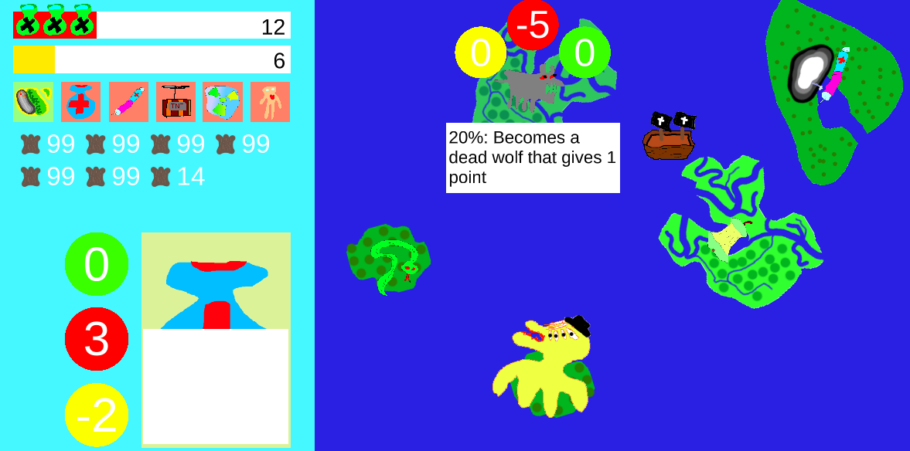
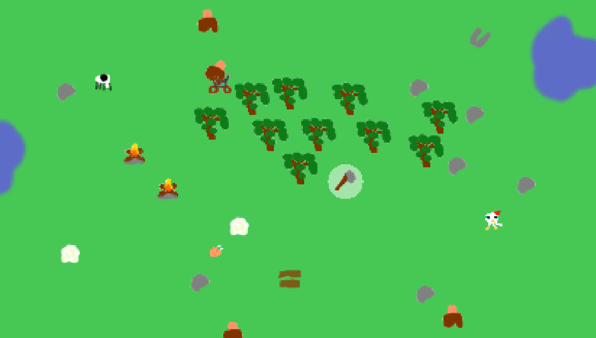
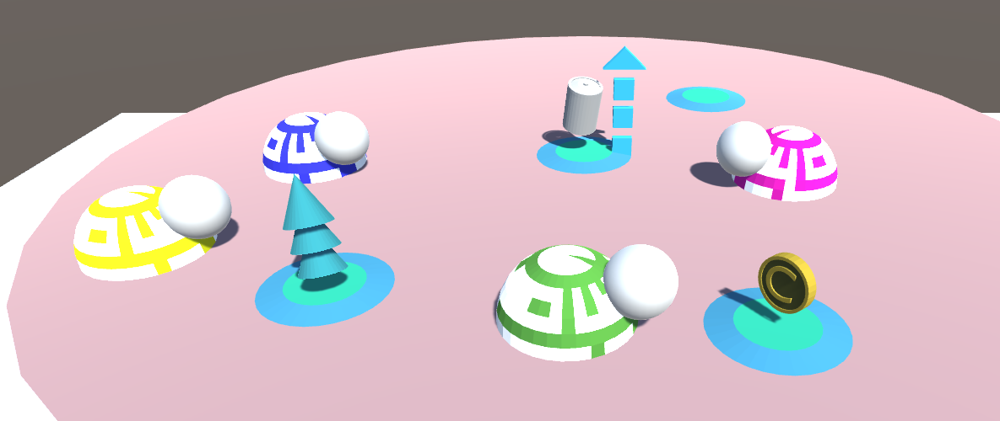
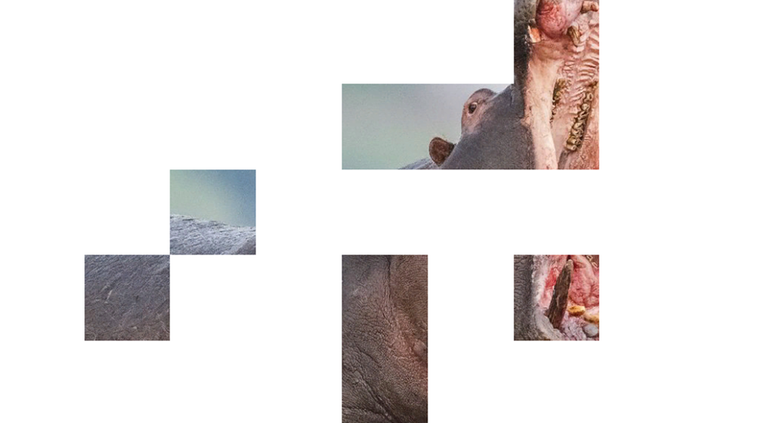
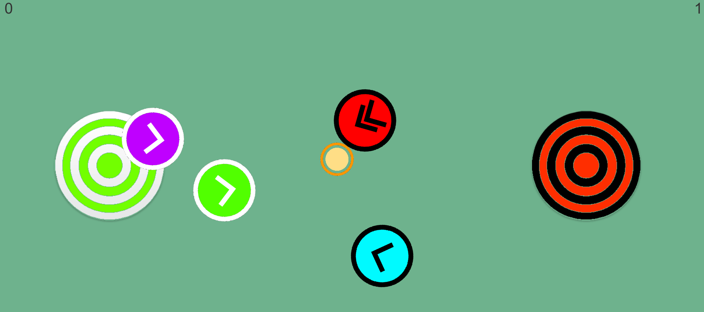
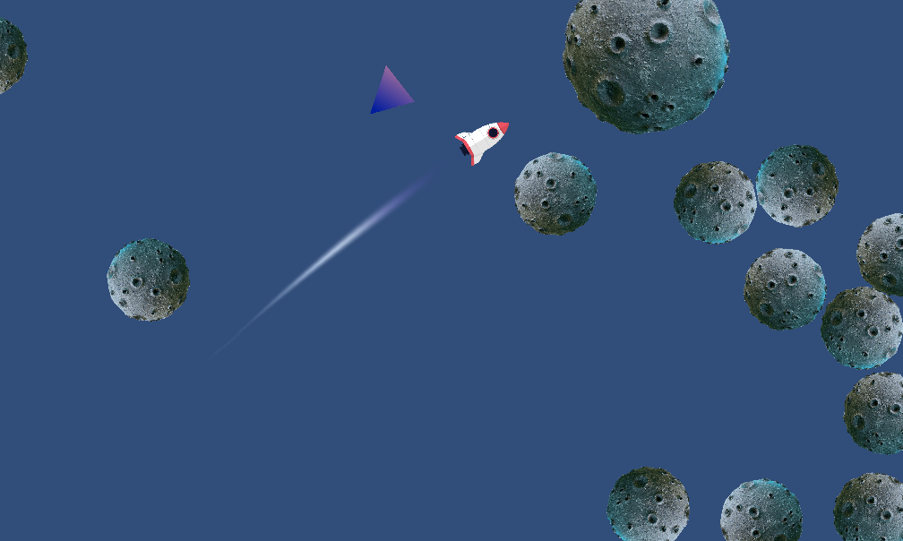
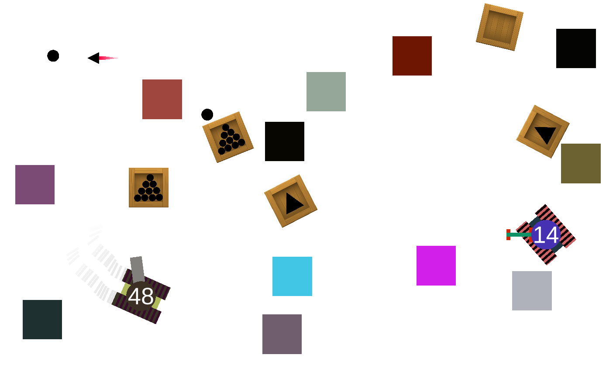

# Old Unity Games Portfolio

Welcome to my collection of Unity games! This portfolio showcases a variety of projects I've worked on, each with its unique concept and gameplay. Below, you will find a brief description of a chosen sample of games along with a visual preview.

For a comprehensive look at all of my projects, please refer to the **AllGamesOverview.docx** document in the repo. This file contains a detailed list of every game, complete with images to give you a visual taste of each project. It's important to note, however, that almost all 3D meshes have unfortunately been lost due to technical issues. As a result, not all games can be presented in their entirety within this document. Below in this README file, we've featured a select few of the games found in the featured collection.

## Explore Islands

Explore Islands is a captivating game where your adventure unfolds across various islands, each represented as a deck of cards. Your objective is to strategically select islands that offer the best items and accumulate enough coins to advance to the next level. Make sure not to lose all your health. Each island only reveals the next monster or item, so be clever in how you play. You will encounter venomous snakes and even tricking aliens. Are you stuck? Then use your coins to purchase power-ups. Use TNT on the hostile monsters so you can discover hidden gems. Prepare for a journey full of surprises and creative strategic decisions.

## Merge World

Merge World invites you into a realm of creativity and discovery. Starting with minimal resources, your task is to combine elements to create new items. From crafting a simple campfire using wood and stone to constructing houses and interacting with the environment, this game challenges you to uncover the correct recipes for creation. Gather resources, fish in the ocean, and build your world in this immersive game.

## Push Off Turtles

In Push Off Turtles, engage in a thrilling four-player battle where the goal is to be the last one standing on the platform. Equip yourself with strategic power-ups to push your opponents off the platform. Fast-paced and competitive, this game tests your reflexes and creative strategy under pressure.

## Bit By Bit

In Bit By Bit, only part of the image is revealed at a time. Divide people into teams and guess what is behind the image before the others. It has different game modes. One mode opens random squares automatically until the image is guessed. Another game mode would be that each team selects squares in turn and also guesses on their own turn. This game was created because I was told to organize a competition for my youth group.

## Ultimate Frisbee

Ultimate Frisbee brings the spirit of team play and strategy to your screen. Play with four players and collaborate to score goals against the opposing team. Remember, you can't move while holding the ball; it must be thrown. Victory requires catching the ball while standing in the opponent's goal. Teamwork and precision are key in this engaging game.

## Rocket Trail

Rocket Trail is a straightforward game that explores rocket flying physics within Unity. It was developed as an experiment to understand how trails work in the game engine. Though simple, it offers insight into the technical aspects of game development and physics implementation.

## Tank Trouble Inspired Game

Inspired by the classic game Tank Trouble, this project aims to enhance the original concept. Engage in intense tank battles where the objective is to outmaneuver your opponents and be the last tank standing. With bullets that bounce off walls and a variety of special weapons to pick up, this game requires skill and strategy. Designed for multiplayer fun, it supports X-box controllers for an immersive gameplay experience.

---

Thank you for exploring my portfolio of Unity games. I hope you find these games as enjoyable to explore as they were for me to create.
